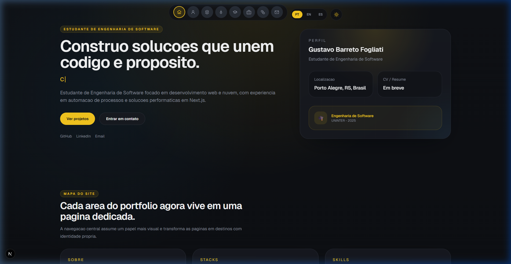
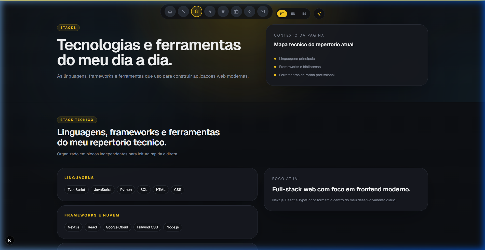
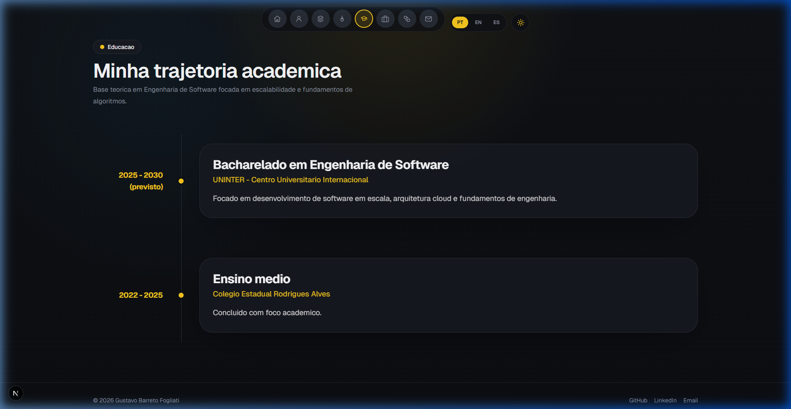
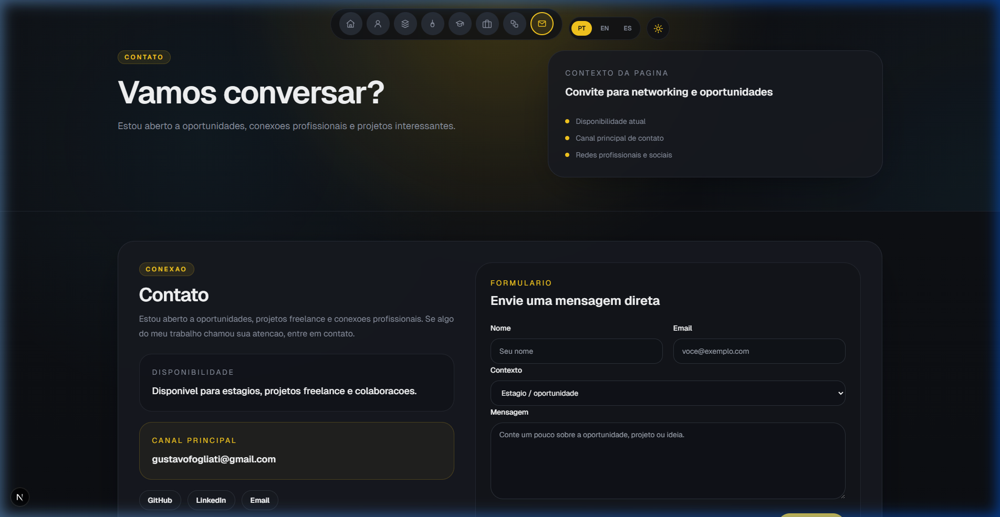

# 👨‍💻 Gustavo Fogliati — Portfólio Pessoal

<div align="center">
  
  <br/>
  <p><i>Desenvolvedor Full-Stack focado em interfaces modernas e experiências minimalistas.</i></p>
</div>

## 📖 Sobre o Projeto

Este é o repositório do meu portfólio pessoal, com as minhas habilidades, experiência, mentalidade técnica e os últimos projetos em que atuei. Desenvolvido com **Next.js 16 (App Router)** e focado fortemente em:
1. **Performance da Web:** Utilização Server Components, fontes otimizadas (Geist) e Core Web Vitals no estado da arte.
2. **Animações e Acessibilidade:** Uso inteligente de **Framer Motion** para transições e interações (Hover spring physics interativos, reveals progressivos) sem sacrificar a velocidade. Interações polidas garantem profissionalismo.
3. **Design System Personalizado:** Tokens HSL para garantir um contraste preciso, dark/light modes unificados em todo o UI. Inspirado em sites minimalistas modernos.

---

## 🛠 Tecnologias 

- **Framework:** [Next.js 16 (App Router)](https://nextjs.org/)
- **Linguagem:** [TypeScript](https://www.typescriptlang.org/)
- **Estilização:** [Tailwind CSS 3](https://tailwindcss.com/)
- **Animações:** [Framer Motion 12](https://www.framer.com/motion/)
- **Fontes:** Geist Sans & Geist Mono (via `next/font`)

---

## 🖼 Telas e Seções

Abaixo estão capturas detalhadas do portfólio demonstrando a estrutura e identidade visual nas duas variantes de tema implementadas:

### Stack tecnico
Uma unica area de repertorio tecnico em `/stacks`, reunindo linguagens e competencias tecnicas abaixo do PageIntro.


### 🎓 Educação
Um showcase da minha formação em **Engenharia de Software (UNINTER)** animado de forma cinemática (Stagger containers).



### 📬 Contato
Finalização direta focada em facilitar conexões. Design centralizado alertando meu status profissional.



---

## 🚀 Como executar localmente

Siga o passo-a-passo abaixo para visualizar as páginas e animações:

**1. Clone o repositório**
```bash
git clone https://github.com/4sofa/portfolio.git
cd portfolio
```

**2. Instale as dependências**
```bash
npm install
# ou use yarn / pnpm
```

**3. Rode o servidor de desenvolvimento**
```bash
npm run dev
```
